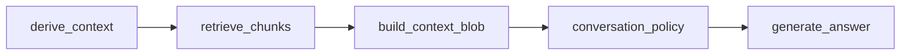

# V1 Roadmap — Generative-UI Portfolio

A fully conversational, AI-enhanced, editorial portfolio experience.

---

## Phase 8 — LangGraph Dev Harness & Evaluation
**Status: In Progress (8.1–8.5 complete; 8.6 in progress)**  

A dedicated development harness for testing, observing, and refining the AI modal agent outside of the production pipeline.

### 8.1 Dev Harness Architecture (`modalGraphApp`)
Create a LangGraph-powered sandbox for the modal agent with a controlled, debuggable state machine.

#### 8.1.1 `ModalGraphState`
State includes:
- `question`
- `pagePath`
- `projectSlug`
- `sectionHeadline`
- `sectionText`
- `history`
- `retrievedChunks`
- `contextBlob`
- `mode` (`answer_direct` | `clarify_then_answer` | `low_context_fallback`)
- `answerText`
- `debugNotes[]`

#### 8.1.2 Nodes
- **derive_context** — Inspect page path, project slug, headline; append debug note.
- **retrieve_chunks** — Stubbed RAG retrieval for now.
- **build_context_blob** — Combine relevant fields (section text, headline, history) into a single context string.
- **conversation_policy** — Decide which conversation mode to use based on question clarity and available context.
- **generate_answer** — Always acknowledges the user; tone is warm and conversational; uses `sectionHeadline` when possible; asks follow-up questions when ambiguous.

#### 8.1.3 Graph Wiring


#### 8.1.4 Deliverable
- Exported `modalGraphApp`
- Deterministic node order
- Transparent debug notes at each step

---

### 8.2 Dev Route: `/api/dev/modal-graph`
A local-only endpoint used for interactive debugging and verifying agent behavior.

#### 8.2.1 Behavior
- Accept request body:
  ```json
  {
    "question": string,
    "pagePath": string,
    "projectSlug": string,
    "sectionHeadline": string,
    "sectionText": string,
    "history": Array
  }
  ```
- Build initial `ModalGraphState`
- Invoke `modalGraphApp.invoke()`
- Return full state as JSON:
  - `answerText`
  - `mode`
  - `contextBlob`
  - `debugNotes`

#### 8.2.2 Purpose
- Quickly check tone, routing, and answer behavior
- Confirm warm conversational flow before integrating with Copywriter Agent
- Independently test edge cases like vague questions ("tell me more")

---

### 8.3 Behavior Definition (Answer Quality)
Foundational behavioral rules for generating warm, human responses.

#### 8.3.1 Requirements
- Always acknowledge the user's question
- Use `sectionHeadline` and `sectionText` when available
- Ask clarifying follow-up questions when ambiguity is genuinely present
- Avoid "AI-speak" or overly generic filler
- Provide concrete, helpful answers when possible

#### 8.3.2 Fallback Behavior
When context is low or missing:
- Never complain about missing inputs
- Provide a grounded, general explanation of Charles’s work
- Ask what direction the user wants to explore (role, tools, process, impact)

---

### 8.4 Evaluation Strategy (LangSmith)
Prepare for automated testing of the modal agent as it evolves.

#### 8.4.1 Dataset A — Final Answer Quality
10 small examples defining:
- Question + page context (pagePath, projectSlug, sectionHeadline, sectionText, history)
- Expected `expected_mode`
- A natural-language description of a "good" answer

Evaluated using a single LLM judge that outputs structured JSON:

```json
{
  "routing_correct": boolean,
  "mode_contract_respected": boolean,
  "answer_quality": 1-5,
  "grounded_in_projects": boolean,
  "explanation": "short rationale"
}
```

The judge checks:
- Mode choice (answer_direct / clarify_then_answer / low_context_fallback)
- Adherence to the mode contract (follow-up questions, overview behavior, etc.)
- Tone (warm, recruiter-friendly, no AI-speak)
- Grounding in real projects (Capital One, Tanger, PMI, Coke, portfolio)

#### 8.4.2 Dataset B — Mode/Routing
10 examples containing:
- Question + page context
- Expected `expected_mode`

Evaluated using the same LLM judge and/or deterministic equality by comparing:
- `expected_mode` (dataset) vs `mode` (from the modal graph run).

#### 8.4.3 Dataset C — Trajectory
5 examples defining the ideal ordered node execution:

```json
["derive_context", "retrieve_chunks", "build_context_blob", "conversation_policy", "generate_answer"]
```

Each example includes `expected_trajectory`, and the modal graph eval returns `trajectory` derived from `executionSteps` (or falls back to the canonical order).

Evaluated via:
- LLM judge reading `expected_trajectory` vs `trajectory`, and/or
- Simple programmatic comparison (order and membership).

---

### 8.5 Target Functions (for LangSmith)
- **Unified Modal Graph Target** — `runModalGraphEval(input)`
  - Input (from dataset):  
    `{ question, pagePath, projectSlug, sectionHeadline, sectionText, history }`
  - Output (for judge + metrics):
    ```json
    {
      "mode": "answer_direct" | "clarify_then_answer" | "low_context_fallback",
      "answer": "final answer string (from answerText)",
      "trajectory": ["derive_context", "retrieve_chunks", "build_context_blob", "conversation_policy", "generate_answer"],
      "debugNotes": ["optional debug strings..."]
    }
    ```
  - Internally:
    - Builds `ModalGraphState` using the same mapping as `/api/dev/modal-graph`
    - Invokes `modalGraphApp.invoke(initialState)`
    - Extracts `mode`, `answerText`, `executionSteps`/trajectory, and `debugNotes` from the final state without changing graph behavior.

---

### 8.6 Success Criteria
- Conversational flow feels natural and human
- Vague questions receive follow-up rather than generic boilerplate
- Responses use page context intelligently
- Debug notes allow clear inspection of agent reasoning
- Routing modes behave predictably
- LangSmith evals pass consistently

---

## Phase 9 — Integrate LangGraph Agent into Modal
**Status: Not Started**  
**Estimated Hours: 12–16 hrs**

Wire the LangGraph dev harness into the existing `/api/ai/modal` route and UI.

### 9.1 Replace Direct Copywriter Call
- Use `modalGraphApp` inside the real modal route.
- Map existing request shape (question, pagePath, topicLabel, sectionHeadline, sectionText, history) into `ModalGraphState`.
- Let `generate_answer` produce the conversational answer.

### 9.2 Bridge to Copywriter Blocks
- For section-based questions, use the graph answer as the **body** of an `answer_block`.
- Continue to store/render answer blocks via the existing Renderer, but with:
  - Warmer, conversational copy from LangGraph
  - Better handling of low-context queries

### 9.3 UI & Interaction Polish
- Ensure hover pills, chips, and inline prompts all call the same modal route.
- Show subtle hints in the UI when the agent is clarifying vs answering directly.

### 9.4 Success Criteria
- The production modal feels like a real conversation, not a static QA block generator.
- Low-context questions are handled gracefully.
- No regressions in JSON shape or rendering.

---

## Phase 10 — Command Palette (Cmd+K) & Global Actions
**Status: Not Started**  
**Estimated Hours: 18–24 hrs**

Build a global command palette inspired by Atlas-style experiences: fast, keyboard-first, and intent-aware.

### 10.1 Command Palette UX
- Global `Cmd+K` / `Ctrl+K` invocation.
- Minimal, elegant overlay:
  - Search bar
  - Result list
  - Hints for navigation vs AI actions
- Visually aligned with the existing editorial design.

### 10.2 Command Types
- **Navigation commands**
  - "Go to Home"
  - "Open Tanger case study"
  - "Jump to About"
- **AI commands**
  - "Summarize this project"
  - "Compare Tanger and PMI"
  - "What should I look at next?"
- **Utility commands**
  - "Contact Charles"
  - "Schedule a chat"

### 10.3 Wiring & Behavior
- Reuse existing intent router where possible.
- For high-confidence navigation commands (e.g., "take me to the PMI page"):
  - Auto-navigate without confirmation when confidence > threshold.
- For mixed/ambiguous intents:
  - Offer options: navigate, scroll, or generate an answer inline.

### 10.4 Dev Harness & Testing
- Local dev page to:
  - Preview palette design
  - Test various input phrases
  - Inspect resolved actions/intent

### 10.5 Success Criteria
- Palette feels as smooth and responsive as Atlas-style experiences.
- Keyboard-first navigation is delightful and predictable.
- AI/Navigation actions are clearly differentiated but share one entry point.

---

## Phase 11 — Contact Flow & Scheduling
**Status: Not Started**  
**Estimated Hours: 10–14 hrs**

Make it easy for people to reach you, with forms wired up and optional scheduling.

### 11.1 Contact Form Implementation
- Simple, focused form:
  - Name
  - Email
  - How they found you (optional)
  - Message / what they’re interested in
- Form lives on:
  - Dedicated Contact page
  - As a command in the Cmd+K palette

### 11.2 Email Delivery
- Use an email provider (e.g., Postmark, Resend, or similar) to:
  - Send form submissions to your inbox
  - Optionally send a confirmation email to the sender

### 11.3 Scheduling Integration
- Connect to a scheduling tool (e.g., Calendly, SavvyCal, or similar):
  - Link from Contact page
  - Expose as a palette command: "Schedule time with Charles"
- Make sure the flow feels cohesive:
  - Contact → "This looks like a fit" → Scheduler

### 11.4 Success Criteria
- You reliably receive inquiries via email.
- Visitors can book time without friction.
- Palette and page-based contact affordances feel unified.

---

## Phase 12 — Post-V1 Analytics & Insight Layer
**Status: Not Started**  
**Estimated Hours: 8–12 hrs**

Lightweight analytics to understand how people actually use the site and the AI features.

### 12.1 Basic Site Analytics
- Integrate a privacy-friendly analytics tool (e.g., Plausible, Fathom, or similar).
- Track:
  - Page views
  - Referrers
  - Basic geography / device breakdown

### 12.2 AI & Palette Usage Events
- Custom events for:
  - Modal opens
  - Types of questions asked (high-level categories only)
  - Command palette opens
  - Most-used commands (navigate vs AI)

### 12.3 Contact & Conversion Signals
- Track:
  - Contact form submissions
  - Clicks to scheduling links
  - Successful scheduled events (if supported by the scheduling provider)

### 12.4 Feedback Hooks (Optional)
- Tiny, low-friction way to capture feedback on AI answers or case studies:
  - "Was this helpful?" thumbs up/down
  - Optional short text comment

### 12.5 Success Criteria
- You can open your analytics dashboard and answer:
  - How are people getting here?
  - What are they looking at?
  - Are they using the AI features and Cmd+K palette?
  - Are they contacting or booking time with you?

---

## Overall V1 Completion Definition
V1 is "done" when:
- The modal agent feels like a warm, capable conversational guide.
- The LangGraph harness + LangSmith evaluation gives you confidence to iterate without fear.
- The command palette provides a fast, Atlas-like way to navigate and query the site.
- Contact and scheduling flows are wired, tested, and comfortable for you to use.
- Analytics give you a clear sense of how the site and AI affordances are being used.

At that point, further work becomes V1.1+ polish and experimentation, not "catch-up" foundational work.